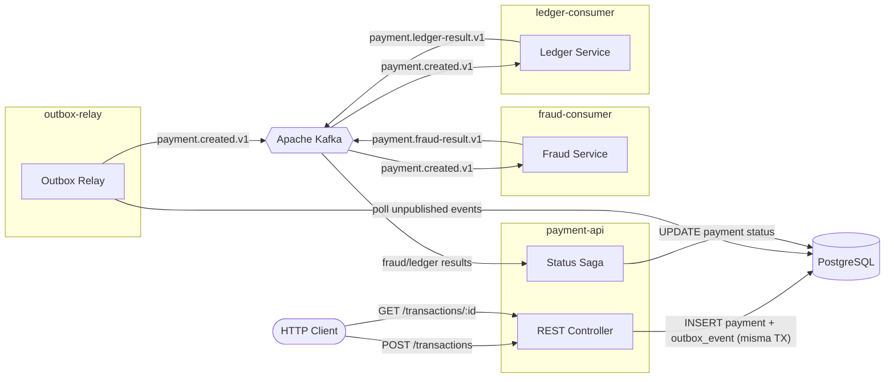

# Payment Settlement Pipeline

Pipeline de liquidacion de pagos con arquitectura event-driven. Monorepo NestJS + Apache Kafka + PostgreSQL.

Solucion al Yape Code Challenge.

---

## Arquitectura



**Flujo resumido:** el API crea el pago y un evento en la misma transaccion DB (transactional outbox). El relay publica a Kafka. Fraud y Ledger procesan en paralelo y publican sus resultados. El Status Saga espera ambos para transicionar: `PENDING -> SETTLED | REJECTED | FAILED`.

Si fraud rechaza (monto > 1000), se marca `REJECTED` inmediato sin esperar ledger.

---

## Estructura

```
apps/
  payment-api/         # API REST + Status Saga consumer
  outbox-relay/        # Poller que publica outbox -> Kafka
  fraud-consumer/      # Validacion anti-fraude
  ledger-consumer/     # Registro contable
libs/
  shared/              # Entidades, DTOs, modulos compartidos
```

---

## Quick Start

### Docker Compose

```bash
docker-compose up --build
```

Levanta PostgreSQL, Zookeeper, Kafka y las 4 apps. API en `http://localhost:3000`.

### Local

```bash
docker-compose up postgres zookeeper kafka -d
npm install
cp .env.example .env
npm run start:all:dev
```

---

## Endpoints

### `POST /transactions`

```bash
curl -X POST http://localhost:3000/transactions \
  -H "Content-Type: application/json" \
  -H "x-correlation-id: 550e8400-e29b-41d4-a716-446655440000" \
  -d '{
    "accountExternalIdDebit": "a1b2c3d4-e5f6-7890-abcd-ef1234567890",
    "accountExternalIdCredit": "f9e8d7c6-b5a4-3210-fedc-ba0987654321",
    "transferTypeId": 1,
    "value": 120
  }'
```

Response `201`:
```json
{
  "transactionExternalId": "uuid",
  "transactionType": { "name": "credit" },
  "transactionStatus": { "name": "PENDING" },
  "value": 120,
  "createdAt": "2026-04-04T15:30:00.000Z"
}
```

### `GET /transactions/:id`

Devuelve el estado actual del pago. Si esta en `PENDING` la consistencia es eventual (aun procesandose).

### `GET /health`

```json
{ "status": "ok", "service": "payment-api" }
```

---

## Decisiones clave

| Aspecto | Decision |
|---------|----------|
| Transactional Outbox | Payment + evento en misma TX de DB. Evita dual-write con Kafka |
| Procesamiento paralelo | Fraud y Ledger son independientes, no se conocen entre si |
| Status Saga | Agrega confirmaciones antes de transicionar. Rechazo de fraude corta inmediato |
| Idempotencia | Tabla `consumer_idempotency` con PK compuesta (eventId + consumerGroup) |
| Dead Letter | Tras 3 reintentos fallidos se publica a `payment.failed.v1` y se persiste para revision manual |

## Limitaciones conocidas

- El retry count del DLT service esta en memoria (se pierde si el proceso reinicia). Habria que persistirlo.
- Ledger no implementa partida doble real, solo simula el registro.
- No hay tests e2e automatizados todavia — solo unitarios.
- `synchronize: true` en TypeORM; para prod habria que usar migrations.

---

## Tests

```bash
npm test          # unitarios
npm run test:cov  # con cobertura
```

## Variables de entorno

Ver `.env.example` para la lista completa.

---

Proyecto privado - Yape Code Challenge.
